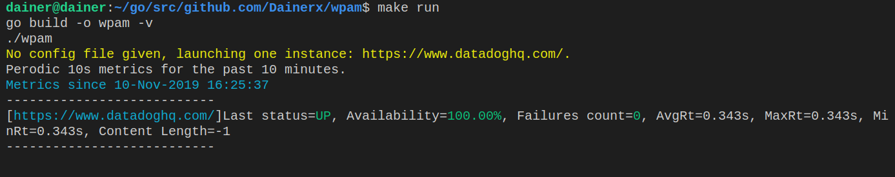
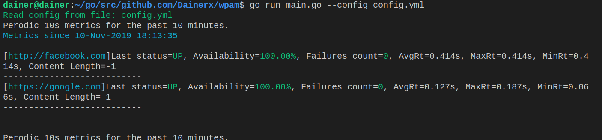
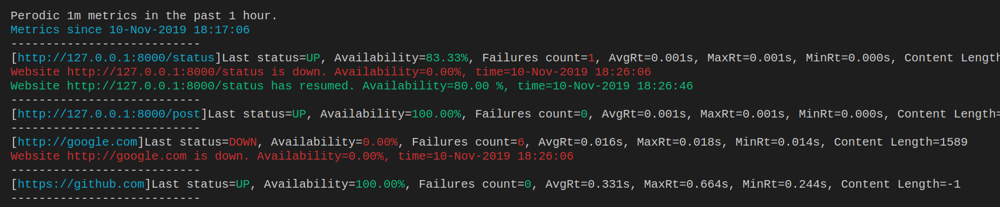

# WPAM: Website Availability & Performance Monitoring 

## Overview

Wpam is a CLI tool written in Go that helps you monitor the up/down status of HTTP endpoints. It detects endpoints with bad response codes, and display its metrics over different timeframes.

Wpam was first created as coding challenge during the interview process with Datadog. Now it is being used as an internal tool with [Vittascience](https://github.com/vittascience) website performance.

### Problem constraints

- Websites and check intervals are user defined.
- Users can keep the console app running and monitor the websites.
- Compute a few interesting metrics: availability, max/avg response times, response codes count and more... Over the different timeframes.
- Every 10s, display the stats for the past 10 minutes for each website.
- Every minute, displays the stats for the past hour for each website.

### WPAM as a Solution

1. Parallelization
    - Every website check instance is ran on seperate thread since the check intervals can easily collude between one instance and the other.
    - All threads share the same memory, hence memory is concurrent on read and write.
    - Main thread is responible for spawning and killing every instance's go routine.
2. Data
    - Data being stored is in form of check response which is a set of results to the instance periodic check.
    - Since all threads share memory, data is stored in a thread-safe data structure (safe store) that ensures the data's integrity through a Mutex.
    - Data life cycle is on runtime, meaning the data is there as long as the program runs.
    - According to the problem constraints, collected data older than one hour are not included in calculating metrics, thus, the safe store performs hourly clean ups to avoid memory saturation and leaks.
3. Metrics
    - Wpam computes different metrics for every instance: max/min/avg response times, availability, failures count and dns look up time.
    - Metrics are computed over different timeframes: 2 minutes, 10 minutes and 1 hour.
4. Display
    - Displaying is done with different colors to improve output's readibility.
    - Every 10s, the metrics of past 10 minutes for each instance are displayed.
    - Every 1 minute, the metrics of past 1 hour for each instance are displayed.
    - Display warnings if instance's input config was not validated.
5. Alerting
    - Wpam watches for website change of state, if website's state changes (UP to DOWN or the other way around) the user is alerted by the change and the time when it occured.
    - All alerts are recorded and shown periodically.
6. Input validation
    - Wpam reads input and validate it before running any instance: duplications, url parsing, http method validation, timeout and check interval against the allowed interval and more...
7. Shutting down
    - Wpam supports a graceful shutdown on shutdown signal capture it stops all instances from running to avoid memory leaks.

### Code Quality

During this project [GolangCI-Lint](https://github.com/golangci/golangci-lint) reports were constantly consulted to ensure code quality and maintainability.

Wpam is also tested against racing conditions.
 
## Installation and Running

### Make file

This project contains a Makefile to facilitate the testing, building and running of the app.

```markdown
$ make help
Choose a command run in :
make all: test and build the project.
make build: build the project.
make test: run all tests.
make clean: clean the project.
make run: build and run the project.
```

**Installing**

`$ make build`

**Running**

- Running with default configuration (monitor https://datadoghq.com/ every 5 seconds)

`$ make run`

- Running with user configuration file as input

```markdown
$ make build
$ ./wpam --config="path/to/config.yml"
```

- Run help command to see usage and flags

```markdown
./wpam --help
wpam: Website Availability & Performance Monitoring Tool made by Oussama Ben Ghorbel

Usage:
  wpam [flags]

Flags:
  -c, --config string   --config path/to/configfile.yaml
  -h, --help            help for wpam
```

### Docker

Wpam can be built and run with Docker. Please see the steps and above to build and run the app on Docker.

1. Building the Docker image

`docker build -t wpam .`

2. Running the app with default config

`docker run -it wpam`

3. Running with user configuration file as input

`docker run -v ${PWD}/examples/config.yml:/wpam/config.yml -it wpam --config=config.yml`

## Configuration

See the [config.yml](examples/config.yml) and [default-config.yml](examples/default-config.yml) files under the folder examples for all available configuration  options, and default configuration ran by Wpam when no input is given.

| Option                          | Description                                                                                                                                                                                                                                       |
|----------------------------------|---------------------------------------------------------------------------------------------------------------------------------------------------------------------------------------------------------------------------------------------------|
| `id`                           | [**Required**] Id of your check instance. This option that ensures no duplications for instances. Make sure every instance has its own different id.                                                                                                                                                               |
| `url`                           | [**Required**] The instance's URL to check.                                                                                                                                                               |
| `httpMethod`                           | [**Optional**] The HTTP method to use for the check, **GET is default**, **allowed methods: [GET,POST]**.                                                                                                                                                               |
| `timeout`                           | [**Optional**] The time in seconds to allow for a response **default: 10s**, **allowed value range: [1s,20s]**.                                                                                                                                                               |
| `httpAcceptedResponseStatusCode`                           | [**Optional**] The accepted http response code, if response's http code is not in this array, response will be judged as DOWN **default: [200]**.                                                                                                                                                               |
| `checkInterval`                           | [**Optional**] Check interval for instance in seconds **default: 5**, **allowed value range: [5s,2minutes]**.                                                                                                                                                               |
| `data`                           | [**Optional**] Use this option to specify a body for your POST request, Content-Type header's value is application/json. **default: Empty map**.                                                                                                                                                               |

## Testing the Alerting feature

Alerting feature is tested through mocking a http endpoint using [httptest package](https://golang.org/pkg/net/http/httptest/).

In [Alert test file](pkg/website_check/alert_test.go) you can see, the behavior of three different http end points are being mocked. Each endpoint defines a different behavior.

1. A http endpoint that's always down and never recovers.
2. A http endpoint that never goes down and always up.
3. A http endpoint that changes its state **four times**: starts with DOWN status resumes goes down again and finally resumes.

**Note:** This test needs to be ran with a 90s or more as timeout

### Running the test

To run the test there are two options:

1. Run test using go test `go test -v -timeout 90s alert_test.go check_request.go check_response.go errors.go`

2. Running **make test** that will eventually run all tests including the alerting test `make test`

## Improvements

1. Core
    - Writing more tests to ensure a maximum coverage.
    - Implement a more performant data structure for the safe store to ensure fast read/write of data.
    - Ensure data persistence by adding a physical storage such as a database.
    - Having the data persisted can open doors for research and machine learning.
    - Save all data in case of shutdown.

2. Data visualization
    - Metrics and stats are much more valuable if they are visualized using plots, histograms and more.
    - Show evolution of metrics for each instance, seeing the different states of an instance over a timeseries is crucial.
    - Implement a GUI frontend to display in a much more user friendly way.

3. Flexiblity for the User
    - Introduce more flags.
    - Make the application listens to user commands while running, for instance user can change HTTP method for an instance or even modify its check interval.
    - Feeding more instances as you go can be a cool feature `wpam add instance -url=http://random.com -c=10s -method=GET

4. Richer and better configuration
    - Support all HTTP methods.
    - Support patterns for `httpAcceptedResponseStatusCode`.
    - Support headers.
    - Support tags.
    - Support SSL certificate verification for https.

5. Metrics
    - Compute more interesting metrics like dns lookup time.

## Screenshots






